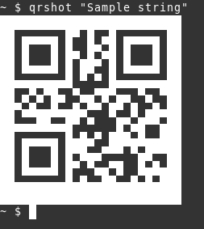

# qrshot
Decode QR code on screen, or encode a string then echo QR code on terminal, on Linux.

## Usage

### Decode

Run `qrshot` in terminal, use mouse to select QR code area on screen.

### Encode

```
$ qrshot "Sample string"
```


## Dependencies

- scrot - screen capturer
- zbar - image QR decoder
- qrencode - QR encoder
